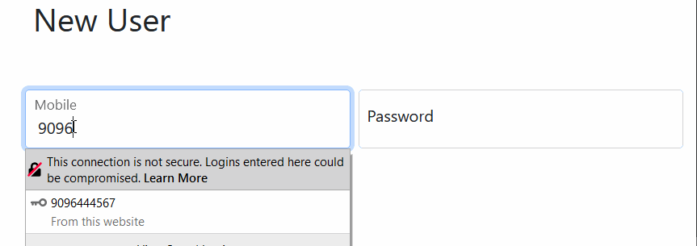
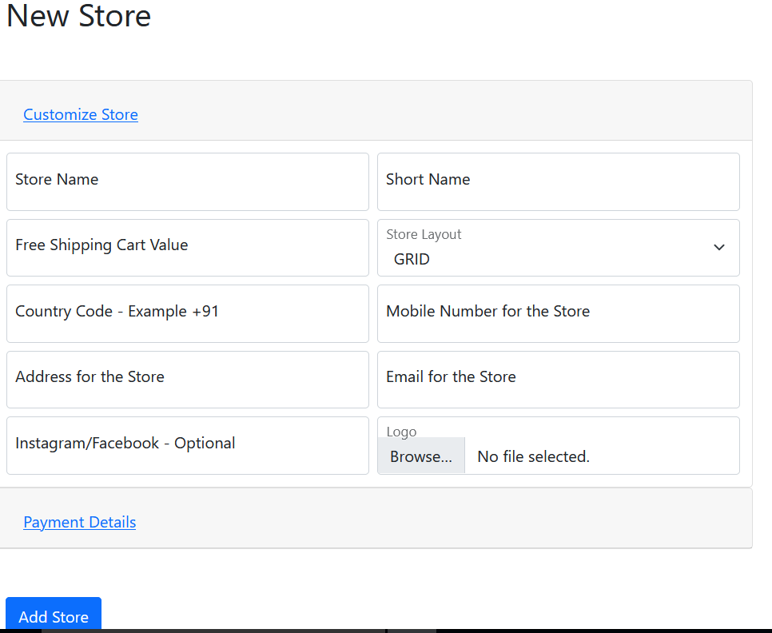
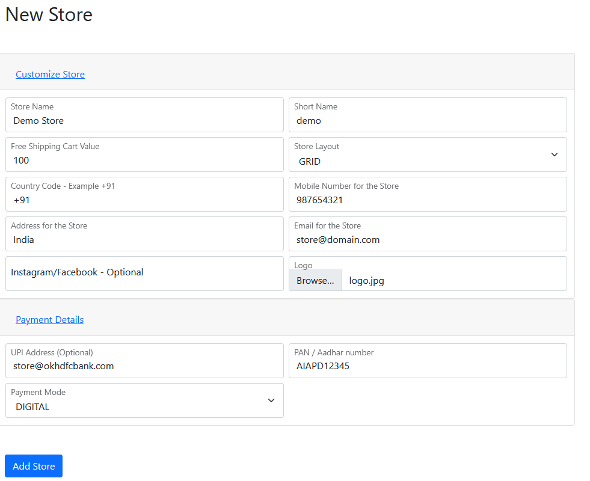
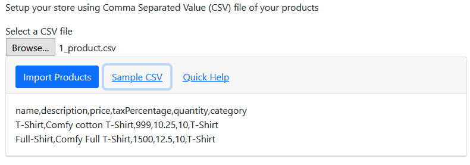
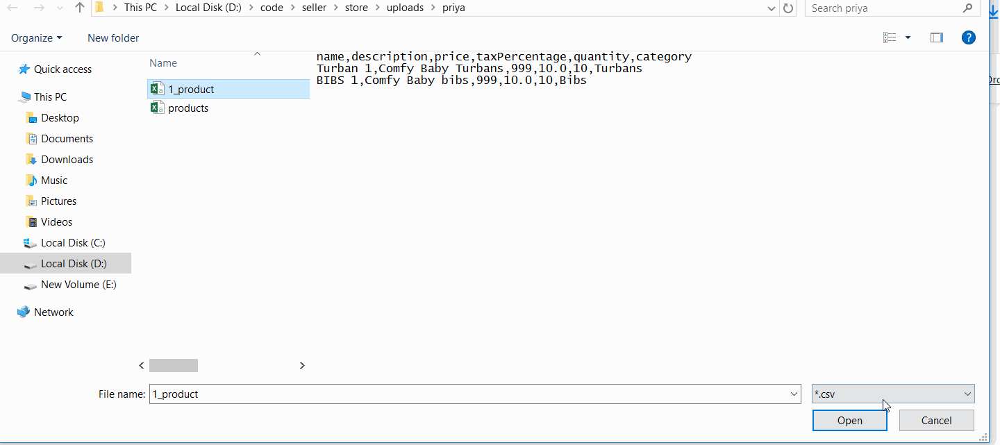

#PikReview -Seller Sign in 

1. go to http://pikReview.com/signup and create a user using your mobile number 

1. Once the user is created , you will be driected to setup your new store 

1. Fill in the required details 

    1. Store Name : Name of your online store 
    2. Short Name : Shortname for your store
    3. Free Shipping Value : Amount after which you provide free shipping 
    4. Store Layout : Theme for the store  
    5. Country code : Country code of your whatsapp number eg +91 for india 
    6. Mobile : Your whatsapp mobile number 
    7. Address : Your location 
    8. Email : Email for your store (optional)
    9. Social Links : Facebook or instagram page (optional)
    10. Logo : A square logo for your store 
    11. Payment details can be also added 
    12. UPI - To accept UPI payments on your store 
    13. Adhar - KYC for your store 
    14. Payment mode - ANY / DIGITAL / COD 
    
1. Now  your store is ready, add products to your store 
    1. Select a CSV of your inventory and upload the same 
    1. if you need help creating a new csv click on link "Sample CSV" 
    
    1. Once you have a CSV select the same and click uplaod 
     